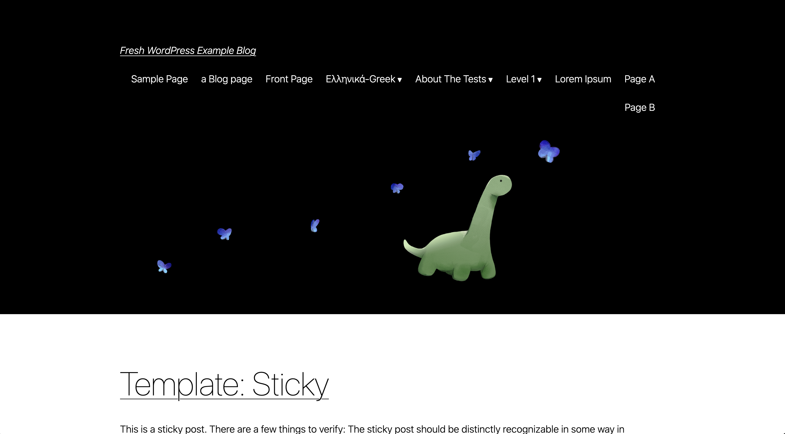

# Fresh WordPress Themes

This repository includes [Fresh](https://fresh.deno.dev/) WordPress themes. You
can start developing WordPress-backed Fresh website using these templates.

See also
[the blog post](https://deno.com/blog/introducing-fresh-wordpress-themes) for
more contexts.

## Blog theme

Blog theme implements typical blog features for WordPress.



Start the blog theme locally:

```
cd blog
deno task docker # this starts local wordpress server at port 80
```

Then open another terminal and run:

```
deno task start # this starts fresh website
```

The website runs at http://localhost:8000/

The WordPress dashboard runs at http://localhost/wp-admin (username: `user`,
password: `password`). You can create, modify, and manage the contents there.

- source: [./blog](./blog)
- online live demo: https://wp-blog-example.deno.dev/

## Shop theme

Shop theme implements features used for typical shop website.


Start the shop theme locally:

```
cd corporate
deno task docker # this starts local wordpress server at port 80
```

Then open another terminal and run:

```
deno task start # this starts fresh website
```

The website runs at http://localhost:8000/

The WordPress dashboard runs at http://localhost/wp-admin (username: `user`,
password: `password`). You can create, modify, and manage the contents there.

- source: [./corporate](./corporate)
- online live demo: https://wp-sweets-co.deno.dev/

The blog theme and shop theme uses different setups for WordPress. Make sure
that you run `deno task docker` in a right directory.
